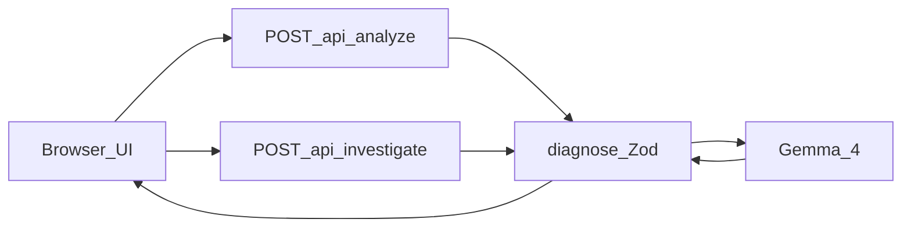

# Screenshot Debugger

[](https://github.com/roldhaa/screenshot-debugger/actions/workflows/ci.yml)
[](LICENSE)

**FR ·** Comprends ton bug. Apprends à le résoudre.  
**EN ·** Understand your bug. Learn how to fix it.

**FR ·** Atelier de débogage guidé pour étudiants et développeurs en JavaScript, TypeScript et React. Une capture d’erreur devient une enquête, une correction expliquée et une fiche réutilisable.  
**EN ·** A guided debugging workshop for JavaScript, TypeScript and React students and developers. An error screenshot becomes an investigation, an explained fix, and a reusable error card.

**FR ·** Esprit Stack Overflow : comprendre, expliquer, partager. Pas d’affiliation.  
**EN ·** Stack Overflow spirit: understand, explain, share. Not affiliated.

**Démo / Live demo :** [https://screenshot-debugger-qzyjc.ondigitalocean.app/](https://screenshot-debugger-qzyjc.ondigitalocean.app/)  
(URL vérifiée le 9 octobre 2026 / checked on 9 October 2026. Quota Google et disponibilité non garantis / not guaranteed.)

| | |
| --- | --- |
| Hackathon | Hacktoberfest Hack Day Montréal x AGEEI — 9 octobre 2026 |
| Catégories MLH | Best Use of Gemma 4 · Best Open-Source AI Project |
| Modèle / Model | Gemma 4 open-weight `gemma-4-26b-a4b-it` (via Gemini API) |
| Hébergement / Hosting | DigitalOcean App Platform Web Service (~5 $ US / mois) |
| Agent Skill | [`.agents/skills/screenshot-debugger/SKILL.md`](.agents/skills/screenshot-debugger/SKILL.md) |
| Model harness | [`docs/HARNESS.md`](docs/HARNESS.md) · `npm run harness:demo` |

---

## Sommaire / Table of contents

1. [Pourquoi gagner / Why this can win](#pourquoi-gagner--why-this-can-win)
2. [Ce qui est livré / What ships](#ce-qui-est-livré--what-ships)
3. [Parcours / User journey](#parcours--user-journey)
4. [Exemple `.map` / Concrete example](#exemple-map--concrete-example)
5. [Architecture et IA / Architecture and AI](#architecture-et-ia--architecture-and-ai)
6. [Installation](#installation)
7. [Tests](#tests)
8. [DigitalOcean](#digitalocean)
9. [Sécurité / Security](#sécurité--security)
10. [Limites / Limits](#limites--limits)
11. [Contribution](#contribution)
12. [Licence](#licence)

---

## Pourquoi gagner / Why this can win

**FR ·** Construit le 9 octobre 2026. Le jury peut vérifier en moins de deux minutes. L’éligibilité aux prix est jugée par les organisateurs, pas certifiée ici.  
**EN ·** Built 9 October 2026. Judges can verify in under two minutes. Prize eligibility is for organizers to decide.

### Critères MLH / DO → ce que tu as déjà / Criteria → what you already have

| Critère MLH / DO | Ton projet / This repo |
| --- | --- |
| Open-weight AI central | Oui : Gemma 4 `gemma-4-26b-a4b-it` dans [`lib/server/gemma.ts`](lib/server/gemma.ts) |
| Accès documenté | Oui : Gemini API = canal ; Gemma = modèle ([doc Google](https://ai.google.dev/gemma/docs/core/gemma_on_gemini_api)) |
| Image réelle, pas du texte inventé | Oui : Files API → `createPartFromUri`, fichier supprimé après l’appel |
| Appel live prouvable | Oui : `npm run harness:demo` / `npm run prove:gemma` → `mode: live` (~9–13 s observés) |
| Dépôt public + licence open source | Oui : GitHub + [MIT](LICENSE) |
| Infra DigitalOcean | Oui : App Platform Web Service, [URL](https://screenshot-debugger-qzyjc.ondigitalocean.app/), ~5 $ US / mois (yaml) |
| Agent Skill (standard ouvert) | Oui : [`.agents/skills/screenshot-debugger/SKILL.md`](.agents/skills/screenshot-debugger/SKILL.md) ([agentskills.io](https://agentskills.io/specification)) |
| Model harness original | Oui : [`diagnose.ts`](lib/server/diagnose.ts) + [`gemma.ts`](lib/server/gemma.ts) + [`docs/HARNESS.md`](docs/HARNESS.md) |
| Produit pédagogique démo-able | Oui : modes Apprendre / Direct, enquête, diff, fiche |
| Clé hors navigateur | Oui : secret serveur DO, jamais `NEXT_PUBLIC_` |

### Best Use of Gemma 4

| Preuve / Proof | Détail / Detail |
| --- | --- |
| Modèle open-weight | `gemma-4-26b-a4b-it` (repli documenté `gemma-4-31b-it`) |
| Budget honnête | Au plus **2** appels fournisseur par requête |
| UI transparente | Badge **live**, modèle affiché, compteur de temps |

### Best Open-Source AI Project

| Preuve / Proof | Détail / Detail |
| --- | --- |
| Skill + harness | Standard ouvert + pipeline original validation → Gemma → Zod |
| CLI sans UI | `npm run harness:demo` = même chemin que `POST /api/analyze` |
| Sécurité pédagogique | Pas d’exécution du correctif, pas de log d’image/code |

### Différence avec un chatbot / vs a general chatbot

**FR ·** Un chatbot explique si on pose les bonnes questions. Ici : indices numérotés, observé ≠ hypothèse, enquête guidée, diff expliqué, vérifications, fiche réutilisable.  
**EN ·** A chatbot helps if you ask well. Here the product structures that work: numbered evidence, observations vs hypotheses, guided investigation, explained diff, verification, reusable card.

**FR ·** Nous n’affirmons pas d’amélioration durable de l’apprentissage sans étude.  
**EN ·** We do not claim lasting learning gains without a study.

### Livré le jour J / Shipped on day one

1. Produit utilisable FR/EN : capture → diagnostic → correction → vérif / usable FR-EN product.
2. 3 boutons démo (Exemple 2 en premier) + 10 captures [`examples/demo-captures/`](examples/demo-captures/).
3. Agent Skill + harness CLI (sans Launchpad ELK/RAG/GPU hors besoin).
4. DigitalOcean App Platform (clé hors navigateur).
5. Preuve manuelle : `node examples/react-map-undefined/verify.mjs`.

Hors scope volontaire : Launchpad Observability / RAG / Airflow, GPU Droplets, cache, OAuth, communauté publique.

---

## Ce qui est livré / What ships

| Fonction / Feature | État / Status |
| --- | --- |
| Analyse live Gemma 4 | Implémenté et vérifié / Implemented & verified |
| Modes **Apprendre** / **Diagnostic direct** | Implémenté et vérifié |
| Enquête `POST /api/investigate` (sans renvoyer l’image) | Implémenté ; route vérifiée en prod |
| Diff avant/après + `changeNotes` | Implémenté et vérifié |
| Fiche Markdown + `localStorage` | Implémenté et vérifié |
| Indices numérotés | Implémenté |
| Annotations pixel | **Non implémenté** / Not implemented |
| Mini défi de transfert | **Non implémenté** |
| Exécution auto du correctif | **Non implémenté** (volontairement) |

---

## Parcours / User journey

```text
Capture + contexte
        |
        v
POST /api/analyze  -->  Gemma 4  -->  rapport enrichi
                                           |
                    +------ Apprendre / Direct ------+
                    |                                |
              question locale                  correction
              indice / explication             diff + vérif
                    |                                |
              enquête (optionnel)  -->  POST /api/investigate
                    |
                    v
              fiche Markdown exportable
```

**FR**

1. Capture PNG/JPEG ou boutons Exemple 1 / 2 / 3.
2. Framework, langue (`fr`/`en`), contexte, code.
3. **Apprendre** (masque la correction) ou **Diagnostic direct**.
4. **Analyser** → `POST /api/analyze` (same-origin). Clé jamais dans le navigateur.
5. Indices, hypothèses ; en Apprendre : indice → explication → **Afficher la correction**.
6. Enquête optionnelle (ou « Je ne sais pas »), max 2 tours.
7. Exporter / sauver la fiche (reste dans ce navigateur).

**EN**

1. Upload PNG/JPEG or load Exemple 1 / 2 / 3.
2. Framework, language, context, code.
3. **Apprendre** (hide fix) or **Diagnostic direct**.
4. **Analyser** → same-origin `POST /api/analyze`. Key never in the browser.
5. Evidence and hypotheses; in Learn: hint → explanation → reveal fix.
6. Optional investigation (or “I don’t know”), max 2 rounds.
7. Export / save the card (this browser only).

**FR ·** Fixtures synthétiques ; avec clé, réponse `mode: live` (pas un script préenregistré).  
**EN ·** Synthetic fixtures; with a key, response is live Gemma, not a canned script.

### Démo jury 60–90 s / Judge demo

1. Ouvre l’URL publique.  
2. **Exemple 2 · null length** → **Apprendre** → **Analyser**.  
3. Badge **live**, indices, question de réflexion.  
4. Indice → **Afficher la correction** → diff → **Exporter ma fiche**.

Phrase / line: « Un étudiant arrive avec une erreur, comprend comment l’enquêter, et repart avec un principe réutilisable. »

---

## Exemple `.map` / Concrete example

**Exemple 1 · React map** — fixture synthétique `public/fixtures/demo-1-react-map.png`.

| | FR | EN |
| --- | --- | --- |
| Visible | `TypeError` lié à `map` | `TypeError` involving `map` |
| À confirmer | État initial manquant **ou** API non-tableau | Missing initial state **or** non-array API |
| Question utile | Comment `users` est initialisé ? Forme de la réponse ? | How is `users` initialized? Payload shape? |
| Fix possible | `[]` + loading **ou** mapping API (`items`) | Safe init + loading **or** fix API mapping |
| Attention | `[]` ne résout pas tous les `.map` | `[]` is not a universal `.map` fix |
| Principe | Vérifier la forme des données au rendu | Check data shape at render time |

```bash
node examples/react-map-undefined/verify.mjs
```

```text
before: TypeError reading map
after: []
```

**FR ·** Correctif appliqué à la main. L’app n’exécute pas le code.  
**EN ·** Hand-applied fix. The app never runs the code.

---

## Architecture et IA / Architecture and AI

| Pièce / Piece | Tech |
| --- | --- |
| App | Next.js 16, React 19, TypeScript, Tailwind 4 |
| Validation | Zod |
| Modèle / Model | **Gemma 4** `gemma-4-26b-a4b-it` |
| Canal / Channel | **Gemini API** (`@google/genai`, Files API) |
| Host | DigitalOcean App Platform (Web Service Node) |



**FR ·** Navigateur = UI. Serveur = validation, prompts, Gemma (≤ 2 appels), Zod. DO héberge Next.js, pas les poids Gemma. Cursor a aidé à écrire le dépôt ; Gemma analyse les captures dans le produit.  
**EN ·** Browser = UI. Server = validation, prompts, Gemma (≤ 2 calls), Zod. DO hosts Next.js, not Gemma weights. Cursor helped write the repo; Gemma analyzes screenshots in the product.

Champs pédagogiques dans le **même JSON** : `learn`, `investigationQuestion`, `learnedPrinciple`, `prevention`, `changeNotes`.

---

## Installation

**Prérequis / Prerequisite :** Node.js `>= 20.9.0`.

```bash
git clone https://github.com/roldhaa/screenshot-debugger.git
cd screenshot-debugger
npm ci
cp .env.example .env
```

**FR ·** Mets `GEMINI_API_KEY` ([Google AI Studio](https://aistudio.google.com/apikey)). Ne la colle pas dans un commit.  
**EN ·** Set `GEMINI_API_KEY`. Never commit the real key.

```bash
npm run dev
# http://localhost:3000
npm run build && npm start
```

| Nom | Utilité / Purpose | Oblig. | Portée |
| --- | --- | --- | --- |
| `GEMINI_API_KEY` | Accès serveur Gemini → Gemma | Oui (live) | Serveur |
| `GEMMA_MODEL` | Id modèle (défaut ci-dessus) | Non | Serveur |
| `PUBLIC_APP_URL` | Allowlist Origin | Non | Serveur |
| `DEMO_ACCESS_TOKEN` | En-tête `x-demo-access` | Non | Serveur |

Jamais `NEXT_PUBLIC_` pour la clé Google.

---

## Tests

```bash
npm test
npm run lint
npm run typecheck
npm run build
node examples/react-map-undefined/verify.mjs
npm run harness:demo
npm run prove:gemma
```

| Commande | Prouve / Proves |
| --- | --- |
| `npm test` | Schémas, API simulée. **Pas** Gemma live |
| `harness:demo` / `prove:gemma` | Appel réel si clé présente (`mode: live`) |
| Eval | [`examples/eval/cases.json`](examples/eval/cases.json) · [`docs/EVAL.md`](docs/EVAL.md) |

---

## DigitalOcean

Spec : [`.do/app.yaml`](.do/app.yaml).

| Réglage | Valeur |
| --- | --- |
| Composant | Web Service Node |
| Région | `tor` |
| Branche | `main`, `deploy_on_push: true` |
| Build / run | `npm run build` / `npm start` |
| Port | `8080` |
| Taille yaml | `apps-s-1vcpu-0.5gb` (~5 $ US / mois ; confirmer au billing) |
| Secret | `GEMINI_API_KEY` |
| Env | `GEMMA_MODEL`, `PUBLIC_APP_URL` |

**FR ·** Push `main` = redéploiement.  
**EN ·** Pushing `main` redeploys.

---

## Sécurité / Security

Détails : [`docs/SECURITY.md`](docs/SECURITY.md).

**FR ·** Clé serveur ; PNG/JPEG 2 Mio ; Origin ; rate limit 12/h · 2 en vol / processus ; Zod ; pas d’exécution ; logs sans image/code/clé. Données envoyées à Google le temps de l’analyse.  
**EN ·** Server key; PNG/JPEG 2 MiB; Origin checks; rate limit 12/h · 2 in flight per process; Zod; no execution; logs without image/code/key. Data goes to Google for the call duration.

| Formulation | Sens / Meaning |
| --- | --- |
| Correction proposée | Suggestion, non appliquée / not applied |
| Résolution déclarée | Case utilisateur, pas validation auto |
| Testé par le système | **N’existe pas** / Does not exist |

---

## Limites / Limits

- Passerelle ~20 s / gateway often ~20 s  
- Rate limit par processus / per process  
- Le modèle peut se tromper / the model can be wrong  
- Captures synthétiques ≠ capture réelle / synthetic ≠ real student capture  
- Annotations pixel et mini défi : non livrés / not shipped  

---

## Contribution

**FR ·** `npm test` + `lint` + `build` avant une PR. Pas de `.env` ni de secrets dans les issues. Signalement vuln : canal privé GitHub s’il est activé.  
**EN ·** Run tests/lint/build before a PR. No `.env` or secrets in issues. Use GitHub private security reporting if enabled.

---

## Licence

[MIT](LICENSE) — Copyright (c) 2026 Harold Tcheuko Wouassi.

**FR ·** Ne couvre pas npm, poids Gemma, ni conditions Google.  
**EN ·** Does not re-license npm packages, Gemma weights, or Google terms.

| Doc | Sujet |
| --- | --- |
| [`docs/HARNESS.md`](docs/HARNESS.md) | Harness |
| [`docs/SUBMISSION.md`](docs/SUBMISSION.md) | Soumission MLH |
| [`PROJECT_STATE.md`](PROJECT_STATE.md) | État du jour |
