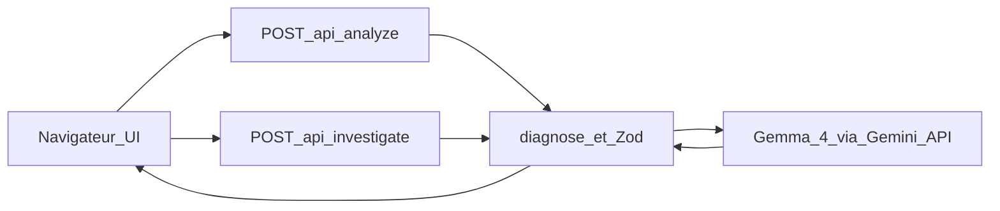

# Screenshot Debugger

[](https://github.com/roldhaa/screenshot-debugger/actions/workflows/ci.yml)
[](LICENSE)

**FR :** Comprends ton bug. Apprends à le résoudre.  
**EN :** Understand your bug. Learn how to fix it.

**Démo / Live demo :** [https://screenshot-debugger-qzyjc.ondigitalocean.app/](https://screenshot-debugger-qzyjc.ondigitalocean.app/)  
(URL vérifiée joignable le 9 octobre 2026 / checked reachable on 9 October 2026. Disponibilité et quota Google non garantis / availability and Google quota not guaranteed.)

| | FR | EN |
| --- | --- | --- |
| Hackathon | Hacktoberfest Hack Day Montréal x AGEEI — 9 octobre 2026 | same date |
| Catégories visées | Best Use of Gemma 4 · Best Open-Source AI Project | Intended categories (organizers decide) |
| Modèle | Gemma 4 `gemma-4-26b-a4b-it` via Gemini API | Gemma 4 open-weight via Gemini API access channel |
| Hébergement | DigitalOcean App Platform | DigitalOcean App Platform |
| Licence | [MIT](LICENSE) | [MIT](LICENSE) |

[Français](#français) · [English](#english)

---

# Français

## Présentation

Screenshot Debugger est un **atelier de débogage guidé** pour les étudiants et développeurs en **JavaScript, TypeScript et React**.

Tu déposes une capture d’erreur (PNG/JPEG), avec éventuellement un contexte et un extrait de code. Tu repartis avec :

- des indices numérotés ;
- une distinction claire entre **observations** et **hypothèses** ;
- une correction minimale proposée, avec un **diff avant / après** expliqué ;
- des étapes de **vérification** ;
- une **fiche Markdown** réutilisable (export et bibliothèque locale optionnelle).

L’ambition est de retrouver l’esprit de Stack Overflow : comprendre, expliquer et partager. **Ce projet n’est pas affilié à Stack Overflow** et n’utilise pas son identité visuelle.

Nous **n’affirmons pas** que l’application réduit durablement les erreurs ou améliore l’apprentissage : cela demanderait une étude. La démo montre un parcours pédagogique, pas un résultat mesuré.

## Problème et public

Un débutant voit souvent une erreur de console ou de terminal sans savoir quoi vérifier ensuite. Un chatbot généraliste peut aider si on pose les bonnes questions. Screenshot Debugger **structure ce travail** grâce aux fonctions réellement présentes dans l’interface.

| Capacité | Ce que fait l’app aujourd’hui |
| --- | --- |
| Indices numérotés | Liste des indices visibles dans la capture |
| Observé vs hypothèse | Sépare ce qui est vu de ce qui est conjecturé |
| Questions ciblées | Bloc Apprendre (`learn`) et question d’enquête optionnelle |
| Enquête de suivi | `POST /api/investigate` (texte seul, sans renvoyer l’image), au plus 2 tours |
| Correction expliquée | `proposedFix`, diff client vs ton extrait, `changeNotes` |
| Vérification | Action + résultat attendu |
| Fiche | Export Markdown + `localStorage` (ce navigateur uniquement) |

## Parcours utilisateur

1. Dépose une capture ou charge **Exemple 1 / 2 / 3**.
2. Règle framework, langue (`fr` / `en`), contexte et code si besoin.
3. Choisis **Apprendre** (correction masquée jusqu’à demande) ou **Diagnostic direct**.
4. Clique **Analyser**. Le navigateur appelle `POST /api/analyze` en same-origin. Le serveur appelle Gemma. La clé n’est jamais dans le navigateur.
5. Lis indices et hypothèses. En mode Apprendre : indice, explication, puis révélation de la correction.
6. Réponds éventuellement à une question d’enquête (ou « Je ne sais pas »).
7. Exporte la fiche Markdown. La sauvegarde locale reste dans **ce navigateur**.

Les images de démo (`public/fixtures/`, `examples/demo-captures/`) sont des **captures synthétiques**. Avec une clé configurée, la réponse est un appel Gemma **live** (`metadata.mode: live`), pas un script préenregistré.



## Fonctionnalités disponibles

| Fonction | État |
| --- | --- |
| Analyse live Gemma 4 (vision) | Implémentée et vérifiée sur la démo publique |
| Modes Apprendre / Diagnostic direct | Implémentés et vérifiés |
| Enquête `POST /api/investigate` | Implémentée ; route vérifiée en production |
| Diff avant/après + notes | Implémenté et vérifié |
| Fiche Markdown + bibliothèque locale | Implémentée et vérifiée |
| Agent Skill (standard ouvert) | [`.agents/skills/screenshot-debugger/SKILL.md`](.agents/skills/screenshot-debugger/SKILL.md) |
| Model harness + CLI | [`docs/HARNESS.md`](docs/HARNESS.md), `npm run harness:demo` |
| Annotations pixel sur la capture | **Non implémenté** (indices numérotés seulement) |
| Mini défi de transfert | **Non implémenté** |
| Exécution automatique du correctif | **Non implémenté** (volontairement) |

## Exemple concret : `.map` sur `undefined`

Bouton **Exemple 1 · React map** (fixture synthétique `public/fixtures/demo-1-react-map.png`).

- **Visible :** une `TypeError` liée à `map`.
- **À confirmer :** `users` est-il `undefined` faute d’état initial, ou à cause d’une réponse API qui n’est pas un tableau ?
- **Question utile :** comment `users` est initialisé, et quelle est la forme de la réponse réseau ?
- **Corrections possibles (selon le contexte) :**
  - premier rendu avant chargement : état initial sûr **et** gestion loading/erreur ;
  - mauvaise forme d’API (ex. `{ items: [...] }`) : corriger le mapping, pas seulement `[]`.
- **Ne pas croire** qu’initialiser à `[]` résout tous les crashs `.map`.
- **Vérifier :** recharger avant les données ; simuler une liste OK ; simuler une réponse incorrecte.
- **Principe :** vérifier la **forme des données** au moment du rendu.

Preuve manuelle d’un correctif appliqué à la main (l’app n’exécute pas ce code) :

```bash
node examples/react-map-undefined/verify.mjs
```

```text
before: TypeError reading map
after: []
```

## Architecture et rôle de l’IA

| Élément | Technologie |
| --- | --- |
| Application | Next.js 16, React 19, TypeScript, Tailwind CSS 4 |
| Validation | Zod (`lib/analysis-schema.ts`) |
| Modèle | **Gemma 4** `gemma-4-26b-a4b-it` (repli `gemma-4-31b-it`) |
| Canal d’accès | **Gemini API** via `@google/genai` (Files API, puis suppression du fichier). Gemini = tuyau ; Gemma = modèle. |
| Hébergement | DigitalOcean App Platform (Web Service Node), pas un site statique |

- **Navigateur :** UI, état Apprendre, presse-papiers, `localStorage` optionnel. Jamais `GEMINI_API_KEY`.
- **Serveur :** validation upload, limites, prompts, appels Gemma (au plus **2** par requête), parse Zod, métadonnées `mode: live`.
- **DigitalOcean :** héberge Next.js pour garder la clé hors client. N’héberge **pas** les poids Gemma.
- **Code classique vs modèle :** validation, origine, rate limit, diff, export = code applicatif. Lecture de la capture, hypothèses, bloc Apprendre, correctif proposé = Gemma, puis validation.

Les champs pédagogiques (`learn`, `investigationQuestion`, `learnedPrinciple`, `prevention`, `changeNotes`) sont demandés dans le **même JSON** que le diagnostic.

## Installation locale

**Prérequis :** Node.js `>= 20.9.0`.

```bash
git clone https://github.com/roldhaa/screenshot-debugger.git
cd screenshot-debugger
npm ci
cp .env.example .env
```

Renseigne `GEMINI_API_KEY` ([Google AI Studio](https://aistudio.google.com/apikey)). Ne la commite pas.

```bash
npm run dev
```

Ouvre [http://localhost:3000](http://localhost:3000).

```bash
npm run build
npm start
```

### Variables d’environnement

| Nom | Utilité | Obligatoire | Portée |
| --- | --- | --- | --- |
| `GEMINI_API_KEY` | Accès serveur à l’API Gemini pour Gemma | Oui pour l’analyse live | Serveur |
| `GEMMA_MODEL` | Identifiant modèle (défaut `gemma-4-26b-a4b-it`) | Non | Serveur |
| `PUBLIC_APP_URL` | Allowlist Origin (URL publique) | Non | Serveur |
| `DEMO_ACCESS_TOKEN` | Si défini, exige l’en-tête `x-demo-access` | Non | Serveur |

Jamais de préfixe `NEXT_PUBLIC_` pour la clé Google.

## Tests et vérification

```bash
npm test
npm run lint
npm run typecheck
npm run build
node examples/react-map-undefined/verify.mjs
npm run harness:demo
npm run prove:gemma
```

| Commande | Ce qu’elle prouve |
| --- | --- |
| `npm test` | Schémas, handlers, markdown, frontière client. **Pas** un appel Gemma réel. |
| `harness:demo` / `prove:gemma` | Appel fournisseur réel si la clé est présente (`mode: live`). |
| Catalogue eval | Cas synthétiques dans [`examples/eval/cases.json`](examples/eval/cases.json) ; critères dans [`docs/EVAL.md`](docs/EVAL.md). Revue humaine nécessaire. |

## Déploiement DigitalOcean

Spec : [`.do/app.yaml`](.do/app.yaml).

| Réglage | Valeur dans le dépôt |
| --- | --- |
| Composant | Web Service Node |
| Région | `tor` (Toronto) |
| Branche | `main`, `deploy_on_push: true` |
| Build / run | `npm run build` / `npm start` |
| Port | `8080` |
| Taille (yaml) | `apps-s-1vcpu-0.5gb` (environ 5 $ US / mois ; confirmer au billing) |
| Secret | `GEMINI_API_KEY` (RUN_TIME) |
| Autres env | `GEMMA_MODEL`, `PUBLIC_APP_URL` |

Un push sur `main` redéploie l’URL publique. La démo dépend du secret et du quota Google.

## Sécurité et confidentialité

Détails : [`docs/SECURITY.md`](docs/SECURITY.md).

Protections présentes (pas une garantie totale) : clé serveur seule ; PNG/JPEG par signature, 2 Mio max ; contrôle d’origine ; jeton démo optionnel ; 12 analyses/heure et 2 en vol par processus ; sortie Zod ; rendu texte React ; pas d’outils modèle ni d’exécution du correctif ; journaux sans image/code/clé.

**Envoyé à Google :** image et textes nécessaires à l’analyse, le temps de l’appel. Pas de galerie d’analyses côté app. Les fiches `localStorage` restent sur l’appareil jusqu’à suppression.

| Formulation | Sens dans cette app |
| --- | --- |
| Correction proposée | Suggestion du modèle, non appliquée |
| Résolution déclarée par l’utilisateur | Case à cocher ; **pas** une validation automatique |
| Correctif testé par le système | **N’existe pas** |

## Limites connues

- Passerelle publique souvent autour de ~20 s.
- Rate limit par processus, pas global multi-instances.
- Le modèle peut se tromper ou omettre la question d’enquête.
- Captures synthétiques ≠ capture réelle d’un étudiant.
- Annotations pixel et mini défi : hors version actuelle.

## Contexte hackathon et open source

Réalisation pour le **Hacktoberfest Hack Day Montréal x AGEEI** (9 octobre 2026). Notes : [`docs/SUBMISSION.md`](docs/SUBMISSION.md).

| Catégorie visée | Appui dans le dépôt |
| --- | --- |
| Best Use of Gemma 4 | Chemin live dans [`lib/server/gemma.ts`](lib/server/gemma.ts) ; preuve `npm run harness:demo` |
| Best Open-Source AI Project | Dépôt MIT, Agent Skill, harness original, UI pédagogique |

**Cursor** a aidé à écrire le dépôt. **Gemma** analyse les captures dans le produit. Ce sont deux rôles différents. DigitalOcean héberge le service web de démo. L’éligibilité aux prix est jugée par les organisateurs, pas certifiée ici.

## Contribution

1. Installer comme ci-dessus.
2. Lancer `npm test`, `npm run lint`, `npm run build` avant une PR.
3. Petites modifications ; ne jamais committer `.env` ni de vraie clé.
4. Dans les issues : **aucune** capture ou log contenant secrets ou données personnelles.
5. Vulnérabilités : utiliser le signalement privé GitHub du dépôt s’il est activé ; ne pas publier d’exploit ni de clé.

Pas de `CONTRIBUTING.md` séparé pour cette version hackathon : cette section fait foi.

## Licence

Code de l’application : [MIT](LICENSE), copyright 2026 Harold Tcheuko Wouassi.

Cela ne place **pas** sous MIT les dépendances npm, les poids Gemma ni les conditions Google de la Gemini API.

## Documentation complémentaire

| Doc | Sujet |
| --- | --- |
| [`docs/HARNESS.md`](docs/HARNESS.md) | Model harness |
| [`docs/SECURITY.md`](docs/SECURITY.md) | Sécurité |
| [`docs/DIGITALOCEAN.md`](docs/DIGITALOCEAN.md) | Hébergement |
| [`docs/EVAL.md`](docs/EVAL.md) | Catalogue d’évaluation |
| [`PROJECT_STATE.md`](PROJECT_STATE.md) | État du projet |

---

# English

## Overview

Screenshot Debugger is a **guided debugging workshop** for students and developers using **JavaScript, TypeScript, and React**.

You paste an error screenshot (PNG/JPEG), optionally with context and a code excerpt. You leave with:

- numbered evidence;
- a clear split between **observations** and **hypotheses**;
- a minimal **proposed fix** with an explained before/after diff;
- **verification** steps;
- a reusable **Markdown error card** (export and optional local library).

The product aims at the spirit of Stack Overflow: understand, explain, and share. **This project is not affiliated with Stack Overflow** and does not reuse its branding.

We do **not** claim measured learning gains or fewer future bugs. That would need a study. The demo shows a pedagogical path, not a proven outcome.

## Problem and audience

Beginners often see a console or terminal error and do not know what to check next. A general chatbot can help if they ask the right questions. Screenshot Debugger **structures that work** using features that actually exist in the UI.

| Capability | What the app does today |
| --- | --- |
| Numbered evidence | Visible clues from the screenshot |
| Observations vs hypotheses | Separates what was seen from what might be true |
| Targeted questions | Learn block (`learn`) and optional investigation question |
| Follow-up investigation | `POST /api/investigate` (text only, no image re-upload), up to two rounds |
| Explained fix | `proposedFix`, client diff vs your snippet, `changeNotes` |
| Verification | Action + expected result |
| Error card | Markdown export + `localStorage` (this browser only) |

## User journey

1. Upload a capture or load **Exemple 1 / 2 / 3**.
2. Set framework, language (`fr` / `en`), context, and code if needed.
3. Choose **Apprendre** (Learn: hide the fix until asked) or **Diagnostic direct**.
4. Click **Analyser**. The browser calls same-origin `POST /api/analyze`. The server calls Gemma. The API key never lives in the browser.
5. Review evidence and hypotheses. In Learn mode: hint, explanation, then reveal the fix.
6. Optionally answer an investigation question (or “Je ne sais pas” / “I don’t know”).
7. Export the Markdown card. Local saves stay in **this browser**.

Demo images under `public/fixtures/` and `examples/demo-captures/` are **synthetic**. With a configured key, analysis is a **live** Gemma call (`metadata.mode: live`), not a pre-recorded script.

(See the Mermaid diagram in the French section above; the flow is identical.)

## Available features

| Feature | Status |
| --- | --- |
| Live Gemma 4 vision analysis | Implemented and verified on the public demo |
| Learn / Direct modes | Implemented and verified |
| Investigation `POST /api/investigate` | Implemented; route verified in production |
| Before/after diff + notes | Implemented and verified |
| Markdown card + local library | Implemented and verified |
| Agent Skill (open standard) | [`.agents/skills/screenshot-debugger/SKILL.md`](.agents/skills/screenshot-debugger/SKILL.md) |
| Model harness + CLI | [`docs/HARNESS.md`](docs/HARNESS.md), `npm run harness:demo` |
| Pixel annotations on the image | **Not implemented** (numbered evidence only) |
| Transfer mini-quiz | **Not implemented** |
| Automatic execution of the fix | **Not implemented** (by design) |

## Concrete example: `.map` on `undefined`

Use **Exemple 1 · React map** (synthetic fixture `public/fixtures/demo-1-react-map.png`).

- **Visible:** a `TypeError` involving `map`.
- **Still to confirm:** is `users` undefined due to missing initial state, or because the API returned a non-array?
- **Useful question:** how is `users` initialized, and what does the network payload look like?
- **Possible fixes (context-dependent):**
  - first render before load: safe initial value **and** loading/error UI;
  - wrong API shape (e.g. `{ items: [...] }`): fix the mapping, not only `[]`.
- **Do not assume** that initializing to `[]` fixes every `.map` crash.
- **Check:** reload before data arrives; simulate a good list; simulate a bad payload.
- **Principle:** verify **data shape** at render time.

Hand-applied fix demo (the app does not run this):

```bash
node examples/react-map-undefined/verify.mjs
```

```text
before: TypeError reading map
after: []
```

## Architecture and role of the AI

| Piece | Technology |
| --- | --- |
| App | Next.js 16, React 19, TypeScript, Tailwind CSS 4 |
| Validation | Zod (`lib/analysis-schema.ts`) |
| Model | **Gemma 4** `gemma-4-26b-a4b-it` (fallback `gemma-4-31b-it`) |
| Access channel | **Gemini API** via `@google/genai` (Files API, then delete the file). Gemini is the pipe; Gemma is the model. |
| Hosting | DigitalOcean App Platform (Node web service), not a static site |

- **Browser:** UI, Learn state, clipboard, optional `localStorage`. Never `GEMINI_API_KEY`.
- **Server:** upload checks, limits, prompts, Gemma calls (at most **two** per request), Zod parse, `mode: live` metadata.
- **DigitalOcean:** runs Next.js so the key stays off the client. It does **not** host Gemma weights.
- **App code vs model:** validation, origin, rate limit, diff, export = application code. Screenshot reading, hypotheses, Learn prompts, proposed fix = Gemma, then validated.

Pedagogical fields (`learn`, `investigationQuestion`, `learnedPrinciple`, `prevention`, `changeNotes`) are requested in the **same JSON** as the diagnosis.

## Local installation

**Prerequisite:** Node.js `>= 20.9.0`.

```bash
git clone https://github.com/roldhaa/screenshot-debugger.git
cd screenshot-debugger
npm ci
cp .env.example .env
```

Set `GEMINI_API_KEY` ([Google AI Studio](https://aistudio.google.com/apikey)). Do not commit real keys.

```bash
npm run dev
```

Open [http://localhost:3000](http://localhost:3000).

```bash
npm run build
npm start
```

### Environment variables

| Name | Purpose | Required | Scope |
| --- | --- | --- | --- |
| `GEMINI_API_KEY` | Server access to Gemini API for Gemma | Yes for live analysis | Server |
| `GEMMA_MODEL` | Model id (default `gemma-4-26b-a4b-it`) | No | Server |
| `PUBLIC_APP_URL` | Origin allowlist (public app URL) | No | Server |
| `DEMO_ACCESS_TOKEN` | If set, requires `x-demo-access` header | No | Server |

Never use a `NEXT_PUBLIC_` prefix for the Google key.

## Tests and verification

```bash
npm test
npm run lint
npm run typecheck
npm run build
node examples/react-map-undefined/verify.mjs
npm run harness:demo
npm run prove:gemma
```

| Command | What it proves |
| --- | --- |
| `npm test` | Schemas, handlers, markdown, client boundary. **Not** a live Gemma call. |
| `harness:demo` / `prove:gemma` | Real provider call when the key is present (`mode: live`). |
| Eval catalog | Synthetic cases in [`examples/eval/cases.json`](examples/eval/cases.json); criteria in [`docs/EVAL.md`](docs/EVAL.md). Human review still required. |

## DigitalOcean deployment

Spec: [`.do/app.yaml`](.do/app.yaml).

| Setting | Value in repo |
| --- | --- |
| Component | Node web service |
| Region | `tor` (Toronto) |
| Branch | `main`, `deploy_on_push: true` |
| Build / run | `npm run build` / `npm start` |
| Port | `8080` |
| Size (yaml) | `apps-s-1vcpu-0.5gb` (about USD 5 / month; confirm in billing) |
| Secret | `GEMINI_API_KEY` (RUN_TIME) |
| Other env | `GEMMA_MODEL`, `PUBLIC_APP_URL` |

Pushing `main` redeploys the public URL. The demo depends on that secret and Google quota.

## Security and privacy

Details: [`docs/SECURITY.md`](docs/SECURITY.md).

Present controls (not a full guarantee): server-only key; PNG/JPEG magic bytes, 2 MiB max; origin checks; optional demo token; 12 analyses/hour and 2 in flight per process; Zod output; React text rendering; no model tools and no auto-execution; logs without image/code/key.

**Sent to Google:** image and text needed for analysis, for the duration of the call. No analysis gallery in the app. `localStorage` cards stay on device until deleted.

| Phrase | Meaning here |
| --- | --- |
| Proposed fix | Model suggestion, not applied |
| User-declared resolved | Checkbox; **not** automatic validation |
| System-tested fix | **Does not exist** |

## Known limits

- Public gateway often around ~20 s.
- Rate limit per process, not global across instances.
- The model can be wrong or omit the investigation question.
- Synthetic demos ≠ a student’s real capture.
- Pixel overlays and transfer quizzes are out of the current release.

## Hackathon and open source

Built for **Hacktoberfest Hack Day Montréal x AGEEI** (9 October 2026). Notes: [`docs/SUBMISSION.md`](docs/SUBMISSION.md).

| Intended category | Support in this repo |
| --- | --- |
| Best Use of Gemma 4 | Live path in [`lib/server/gemma.ts`](lib/server/gemma.ts); prove with `npm run harness:demo` |
| Best Open-Source AI Project | MIT repo, Agent Skill, original harness, pedagogical UI |

**Cursor** helped write the repository. **Gemma** analyzes screenshots in the product. Those are different roles. DigitalOcean hosts the demo web service. Prize eligibility is for organizers to decide, not certified here.

## Contributing

1. Install as above.
2. Run `npm test`, `npm run lint`, and `npm run build` before a PR.
3. Keep changes small; never commit `.env` or real keys.
4. In issues: **never** paste screenshots or logs with secrets or personal data.
5. For vulnerabilities: use GitHub private reporting for this repo if enabled; do not post exploits or keys publicly.

No separate `CONTRIBUTING.md` for this hackathon release; this section is authoritative.

## License

Application code: [MIT](LICENSE), Copyright (c) 2026 Harold Tcheuko Wouassi.

This does **not** re-license npm dependencies, Gemma weights, or Google’s Gemini API terms.

## Further reading

| Doc | Topic |
| --- | --- |
| [`docs/HARNESS.md`](docs/HARNESS.md) | Model harness |
| [`docs/SECURITY.md`](docs/SECURITY.md) | Security |
| [`docs/DIGITALOCEAN.md`](docs/DIGITALOCEAN.md) | Hosting |
| [`docs/EVAL.md`](docs/EVAL.md) | Eval catalog |
| [`PROJECT_STATE.md`](PROJECT_STATE.md) | Project state |
